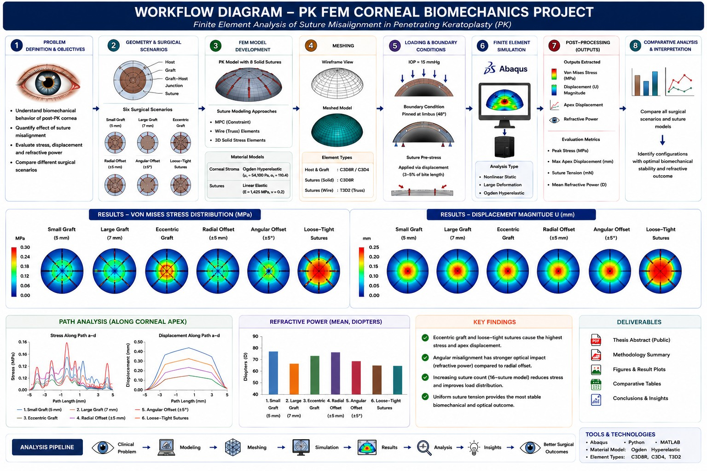

# PK-FEM-Corneal-Biomechanics

**Finite Element Analysis of Suture Misalignment in Penetrating Keratoplasty (PK)**  
M.Tech Thesis · IIT Hyderabad · Ophthalmic Engineering · June 2025

---



## Abstract


Understanding the biomechanical response of the cornea following penetrating
keratoplasty is crucial for improving surgical outcomes and reducing postoperative
complications. This study investigates how graft size, suture configuration, and
alignment affect stress distribution, apex displacement, and refractive outcomes using
finite element simulations. Sutures were modeled as MPC constraints, wire elements,
and 3D solids. Results showed that smaller grafts concentrated stress at the graft-host
junction, while larger grafts caused greater displacement. Eccentric placement and
uneven suture tension increased stress and instability. Evenly spaced sutures provided
better stability. The findings highlight the importance of precise suture placement and
graft alignment in PK.

---


## Overview

This repository documents the research conducted as part of my M.Tech thesis at IIT Hyderabad. The study investigates the **biomechanical and refractive consequences of suture misalignment in Penetrating Keratoplasty (PK)** — a full-thickness corneal transplant surgery — using three-dimensional finite element simulations.

The cornea contributes roughly two-thirds of the eye's total refractive power. Even small post-surgical irregularities in graft placement or suture tension can lead to clinically significant complications such as astigmatism, irregular topography, and poor visual recovery. This work provides a computational framework to understand and quantify those effects.


---

## Research Objectives

- Develop a high-fidelity 3D finite element model of the human cornea undergoing PK
- Represent sutures using three modelling strategies: MPC constraints, wire (truss) elements, and 3D solid stress elements
- Simulate clinically relevant surgical variations:
  - Graft diameter variation (5 mm, 7 mm, 8 mm)
  - Eccentric graft placement
  - Radial and angular suture offsets (±5°)
  - Non-uniform suture tension (loose vs. tight)
  - Increased suture count (16-suture model)
- Evaluate von Mises stress distribution, apex displacement, and corneal refractive power across configurations

---

## Methodology

### Geometry
- Corneal geometry constructed from a 2D axisymmetric profile revolved around the Y-axis
- Anterior radius of curvature: **7.8 mm** | Central thickness: **0.545 mm** | Peripheral thickness: **0.695 mm**
- Three components modelled: host cornea, donor graft, and sutures
- Suture arc diameter: **0.03 mm** (matching 10-0 nylon specifications)
- Eight uniformly spaced interrupted sutures in the baseline model

### Material Models
| Component | Model | Key Parameters |
|-----------|-------|----------------|
| Corneal stroma | Ogden hyperelastic | μ₁ = 54,100 Pa, α₁ = 110.4 |
| Sutures | Linear elastic | E = 1,425 MPa, ν = 0.2 |

Only the stromal layer was modelled (≈90% of total corneal thickness), which provides primary mechanical support.

### Meshing
| Model Type | Element Type | Host Elements | Graft Elements | Suture Elements |
|---|---|---|---|---|
| Solid suture | Hex C3D8R + Tet C3D4 | 81,728 + 38,223 | 86,800 + 44,028 | 460 |
| Constraint suture | Hex C3D8R + Truss T3D2 | 108,000 | 81,000 | 380 |

### Loading & Boundary Conditions
- Intraocular pressure (IOP): **15 mmHg** applied uniformly on the posterior corneal surface
- Boundary condition: pinned at the host limbal periphery (48°)
- Suture prestress: applied via displacement boundary condition (3–5% of bite length)

### Suture–Tissue Interaction
- **MPC model:** tie constraints connecting bite-node pairs across the graft-host junction
- **Wire model:** embedded T3D2 truss elements within the corneal volume
- **Solid model:** tie constraints between suture ends and corneal suture holes

### Refractive Power Estimation
Corneal optical power was estimated from the deformed geometry using:

```
P = (η_c − 1) / R_ext + (η_ah − η_c) / R_int
```

where η_c = 1.376 (cornea), η_ah = 1.336 (aqueous humor), R_ext and R_int are the fitted anterior and posterior radii of curvature.

---

## Key Results

### MPC Suture Model

| Configuration | Max Apex Displacement (mm) | Peak Stress (MPa) | Mean Refractive Power (D) |
|---|---|---|---|
| Small graft (5 mm) | 0.122 | 0.032 | 53.20 |
| Large graft | 0.112 | 0.032 | 53.10 |
| Radial offset | 0.075 | 0.024 | 59.53 |
| Angular offset | 0.094 | 0.029 | 62.22 |
| Eccentric graft | **0.141** | **0.237** | 54.79 |

### Solid Suture Model

| Configuration | Max Suture Tension (mN) | Max Apex Displacement (mm) | Peak Stress (MPa) | Mean Refractive Power (D) |
|---|---|---|---|---|
| Small graft (5 mm) | 12.20 | 0.158 | 17.26 | 71.11 |
| Large graft (7 mm) | 13.50 | 0.194 | 19.15 | 60.65 |
| Radial offset | 19.57 | 0.175 | 27.67 | 64.01 |
| Angular offset | 20.50 | 0.216 | 32.38 | 62.58 |
| Eccentric graft | 26.83 | 0.173 | 37.94 | 63.70 |
| Loose–tight sutures | 39.40 | 0.203 | **207.30** | 60.62 |
| 16-suture model | **8.08** | 0.180 | **11.43** | 61.01 |

### Summary of Findings

- **Smaller grafts** concentrate stress at the graft–host junction; **larger grafts** produce greater apex displacement
- **Eccentric graft placement** caused the highest peak stress (MPC model: 0.237 MPa; solid model: 37.94 MPa) and asymmetric deformation
- **Non-uniform suture tension** (loose–tight) produced the most severe stress concentration (207 MPa), representing a major surgical risk
- **Uniformly spaced sutures** with consistent tension provided the most biomechanically stable response
- **Increasing suture count** (16-suture model) significantly reduced peak stress and improved load distribution
- Angular misalignment had a stronger refractive impact (62.22 D) relative to its mechanical effect, highlighting a biomechanical–optical trade-off

---

## Repository Structure

```
PK-FEM-Corneal-Biomechanics/
│
├── README.md
├── LICENSE
├── .gitignore
│
├── docs/
│   ├── thesis_abstract.pdf        # Public abstract only
│   └── methodology_summary.pdf    # Methods overview (no IP)
│
├── results/
│   ├── stress_distribution/       # Von Mises stress contour plots
│   ├── displacement_distribution/ # Displacement field plots
│   ├── apex_path_plots/           # Stress & displacement along corneal path
│   └── refractive_analysis/       # Refractive power tables & surface plots
│
└── figures/
    ├── geometry/                  # Model geometry sketches
    ├── meshing/                   # Mesh visualizations
    └── surgical_scenarios/        # Schematic diagrams of PK configurations
```

> **Note:** Simulation input files, Abaqus scripts, and raw data are not included in this public repository to comply with institutional IP guidelines. The repository showcases research methodology, results, and findings.

---

## Tools & Technologies

| Category | Tool / Method |
|---|---|
| FEM Solver | Abaqus (Dassault Systèmes) |
| Geometry & Mesh | Abaqus CAE |
| Scripting / Automation | Python (parametric model generation) |
| Post-processing | Abaqus Viewer, MATLAB |
| Material Model | Ogden hyperelastic (nonlinear) |
| Suture Models | MPC constraints, T3D2 truss elements, C3D4 solid elements |

---

## Skills Demonstrated

- 3D solid mechanics and nonlinear finite element analysis
- Hyperelastic material modelling (Ogden formulation)
- Biomechanical simulation of soft biological tissues
- Python scripting for parametric FEM model generation
- Quantitative analysis of stress, displacement, and optical outcomes
- Scientific visualisation and result interpretation
- Ophthalmic engineering and corneal biomechanics domain knowledge

---

## Citation

If you reference this work, please cite:

```
Yadav, A. (2025). Study of Suture Misalignment in Penetrating Keratoplasty (PK).
M.Tech Thesis, Indian Institute of Technology Hyderabad.
Adviser: Dr. Viswanath Chinthapenta, Dept. of Mechanical & Aerospace Engineering.
```

---

## Acknowledgements

This research was conducted under the supervision of **Dr. Viswanath Chinthapenta**, Department of Mechanical & Aerospace Engineering, IIT Hyderabad, at the MICRO-MECHANICS Lab. I am grateful to the faculty of the Ophthalmic Engineering program and my labmates for their support throughout this work.

---

## License

This repository is licensed under the **Creative Commons Attribution-NonCommercial 4.0 International (CC BY-NC 4.0)** license.  
You are free to share and adapt this material for non-commercial purposes with appropriate attribution.  
See [LICENSE](LICENSE) for details.